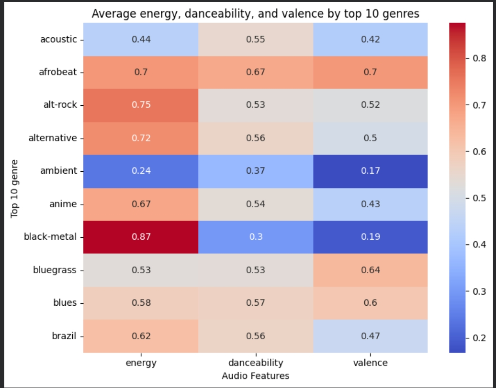
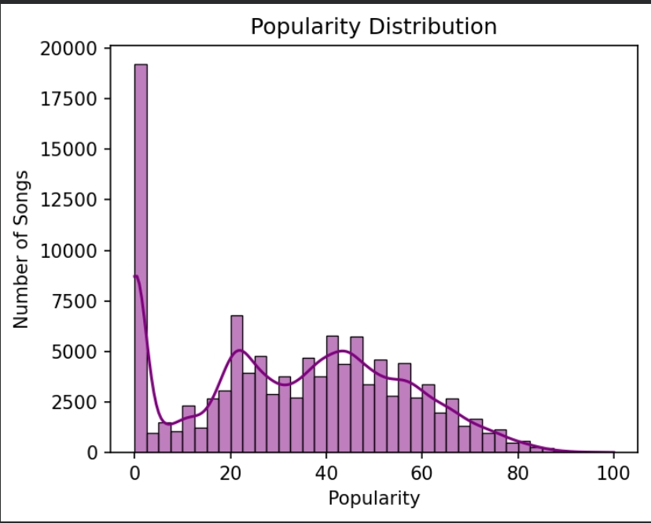
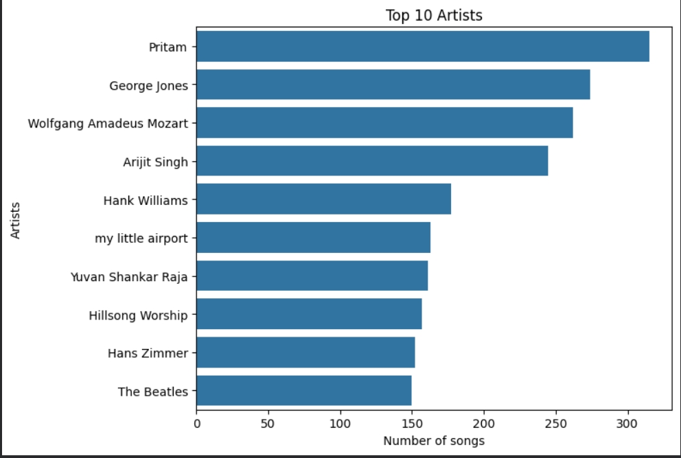

# 🎵 Spotify Data Analysis & Recommendation System

## 📌 Project Overview

This project performs Exploratory Data Analysis (EDA) on a Spotify dataset and builds feature-based recommendation systems to suggest similar songs based on audio characteristics.

## 📂 Dataset

* Dataset contains ~114,000 songs
* Features include:

  * Artist, Track Name
  * Popularity
  * Audio features (energy, danceability, valence, etc.)
  * Genre

## 🛠️ Tools Used

* Python
* Pandas
* Matplotlib
* Seaborn

## 🧹 Data Cleaning

* Removed rows with missing values
* Removed duplicate songs using track name and artist
* Processed multi-artist entries using split and explode

## 📊 Exploratory Data Analysis

* Most popular songs and artists
* Genre-based popularity trends
* Audio feature analysis using heatmaps
* Relationship between energy and popularity

## 🎯 Recommendation Systems

### 1️⃣ Similar Song Recommendation

* Recommends songs based on:

  * Same genre
  * Closest energy
  * Closest popularity

### 2️⃣ Mood-Based Recommendation

* Chill 😌 → low energy, high acousticness
* Energetic 🔥 → high energy
* Party 🎉 → high danceability and valence

### 3️⃣ Similarity Score System

* Uses multiple features:

  * Energy
  * Popularity
  * Danceability
* Calculates a similarity score to find closest songs

## 📊 Sample Visualizations

### Heatmap of Audio Features

### Popularity Distribution

### Top Artists

## 💡 Key Insights

* Energy has weak correlation with popularity
* Certain genres dominate total popularity
* Songs with similar audio features can be grouped for recommendations

## 🏁 Conclusion

This project demonstrates how audio features can be used to analyze music trends and build simple yet effective recommendation systems.

## 📎 Author

Ankit Anand
